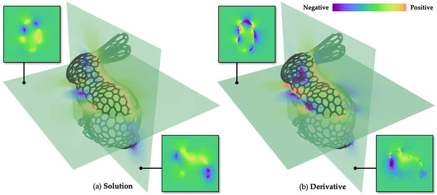

# A Differential Monte Carlo Solver For the Poisson Equation
<br />
<p align="center">
  <a href="https://shuangz.com/projects/diff-wos-sg24/">
    
  </a>
</p>
<br />
This repository contains the code for reproducing the results from the paper ["A Differential Monte Carlo Solver For the Poisson Equation"](https://shuangz.com/projects/diff-wos-sg24/), Zihan Yu, Lifan Wu, Zhiqian Zhou, and Shuang Zhao, 2024.

Getting started
---------------
The code is written in C++, CUDA, and Python. It has been tested on Ubuntu 20.04 with GCC 10.5.0, CUDA 12.2, and Python 3.11.

First, clone the repository:
```bash
git clone --recursive 
```

If you are using conda, you can create a new environment with the following command:
```bash
conda env create -f environment.yml
```
Then, activate the environment and install the dependencies:
```bash
conda activate .conda
```
Finally, compile the project:
```bash
mkdir build
cd build
CC=gcc-10 CXX=g++-10 cmake ..
cmake --build . --config Release
```
The Python bindings will be compiled in the `build/python` directory. You can add this to your `PYTHONPATH`. If you're using vscode, the cloned `.vscode` folder should automatically add the path for you.

**Important**: Make sure the project, `drjit`, and `mitsuba` are compiled with identical compiler and settings for binary compatibility. If you've used `pip` to install pre-built versions of `drjit` and `mitsuba`, compile this project using GCC 10 for binary compatibility since pre-built packages were compiled with it. The compiler used for pre-built packages can be found [here](https://github.com/mitsuba-renderer/mitsuba3/actions/runs/7173174520/job/19531943421#step:9:348). Failing to do so may lead to type-mismatch errors due to binary incompatibility.

Differentiable PDE Solve Examples
---------------
`diff_solve` directory contains the differentiable PDE solve examples. You can replicate the results by directly running the scripts in that directory. By default, the scripts will run the primal Walk-on-Spheres solver. To run the differential solvers, uncomment the corresponding lines in the scripts.

Inverse PDE Solve Examples
---------------
`inverse_solve` directory contains the inverse PDE solve examples. You can replicate the results by directly running the scripts in that directory. By default, the scripts will run the optimization with our method. To run the baseline methods, uncomment the corresponding lines in the scripts.

Ablation Study
---------------
The ablation study evaluates the performance of four normal-derivative estimators and is located in the `ablations` directory. You can replicate the results by directly running the scripts in that directory.

Citation
--------
```bibtex
@inproceedings{10.1145/3641519.3657460,
    author = {Yu, Zihan and Wu, Lifan and Zhou, Zhiqian and Zhao, Shuang},
    title = {A Differential Monte Carlo Solver For the Poisson Equation},
    year = {2024},
    address = {New York, NY, USA},
    doi = {10.1145/3641519.3657460},
    booktitle = {ACM SIGGRAPH 2024 Conference Papers},
}
```